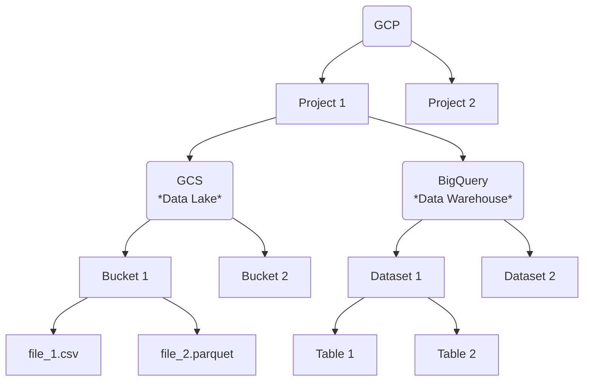
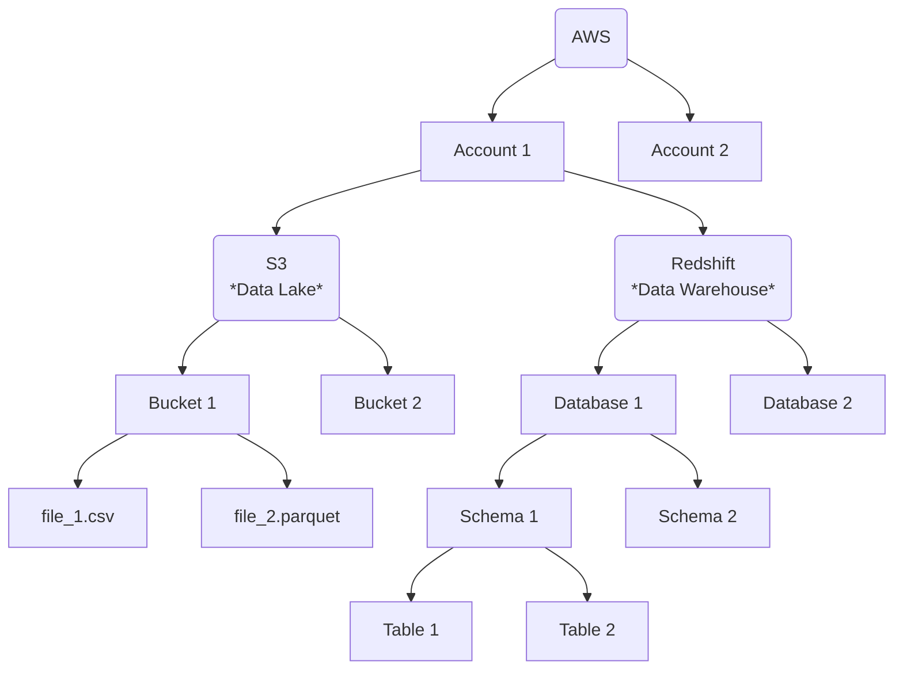

# {{ title }}

{{ description }}

<!-- more -->

For a data professional, the cloud is more than just "someone else’s computer." It is a vast, multidimensional filing system. Whether you are a data engineer building robust pipelines or a data scientist hunting for the perfect feature set, your efficiency depends on understanding the logical scaffolding of your environment. While Google Cloud Platform (GCP) and Amazon Web Services (AWS) offer comparable services, they organize their universes using fundamentally different philosophies.

## The Google Cloud Philosophy: Project-Centric Organization

Google Cloud is built on a hierarchy designed for agility and "shared-nothing" isolation. At the heart of this ecosystem is the **Project**. Unlike other clouds where resources might feel scattered, every single GCS bucket, BigQuery table, or virtual machine in Google Cloud must belong to a specific project. This makes billing and resource grouping intuitive: if you delete a project, every data asset within it vanishes instantly.

When we look at the **Data Lake** layer through Google Cloud Storage (GCS), the structure is elegantly shallow. Within a project, you create buckets. These buckets act as the primary containers for your "unstructured" data—everything from raw `.csv` dumps to complex `.parquet` files. The path is direct: Project  Bucket  Object.

Moving into the **Data Warehouse** realm with BigQuery, Google introduces a middle layer called the **Dataset**. If the project is the house, the dataset is the room. It is here that you define access controls and data residency. Inside these datasets sit your tables. Because BigQuery is serverless, you don't worry about the underlying hardware; you simply interact with this logical chain of Project  Dataset  Table to run your SQL queries.

Here's a diagram showing the logical hierarchy in GCP:

## The AWS Philosophy: The Account as a Boundary

Amazon Web Services approaches organization through the lens of the **AWS Account**. While GCP projects are lightweight and easy to spin up, an AWS account is a more heavyweight security and billing boundary. In large enterprises, these accounts are often grouped under "AWS Organizations," but for the data professional, the account is the primary sandbox.

The **Data Lake** journey in AWS begins with Amazon S3. S3 is famous for its flat hierarchy that masquerades as a file system. Within an account, you create buckets, and inside those buckets, you store objects. While your console might show "folders," these are technically just "prefixes"—part of a long string that identifies a file. This subtle distinction is why S3 can scale to trillions of objects without breaking a sweat.

The **Data Warehouse** structure in Amazon Redshift is notably more "traditional" and deeper than its Google counterpart. Because Redshift evolved from classic relational database roots, it maintains a multi-layered hierarchy. An account hosts a Redshift cluster, which contains one or more **Databases**. Within those databases, you find **Schemas**, and only within those schemas do your **Tables** reside. This Account  Database  Schema  Table structure provides a familiar environment for those coming from on-premise SQL Server or PostgreSQL backgrounds, offering granular layers for organizing complex enterprise data models.

Here's another showing the logical hierarchy in AWS:

## Why the Structure Dictates Your Workflow

Understanding these maps is the difference between a clean deployment and a security nightmare. For instance, a Data Engineer in **GCP** might find it easier to manage permissions at the Dataset level, allowing a specific team to query tables without seeing the raw files in the GCS bucket. Conversely, a Data Scientist in **AWS** must be comfortable navigating the Schema layer in Redshift to find the specific "gold-standard" tables cleaned by the engineering team, as the Database level is often too broad for daily tasks.

Ultimately, Google’s model favors **project-based isolation**, making it ideal for startups or labs where different experiments need clear boundaries. AWS’s model favors **structural depth and traditional governance**, making it a powerhouse for massive organizations that require nested layers of organization. As you build your career, mastering these hierarchies ensures that your data isn't just stored—it's accessible, secure, and ready for insight.

