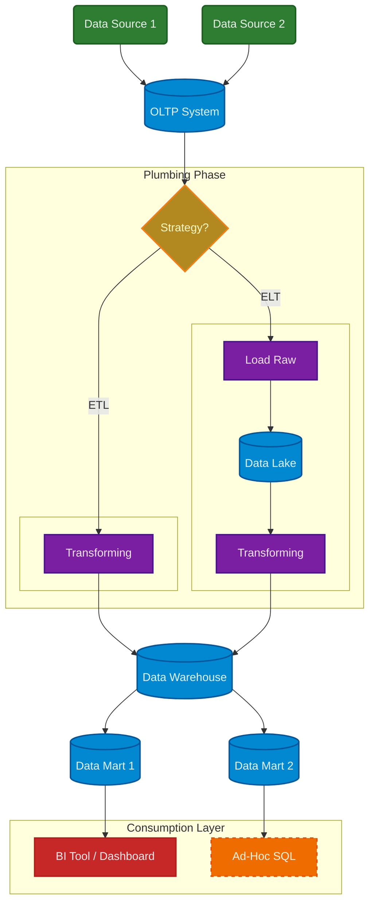

# {{ title }}

{{ description }}

<!-- more -->

Imagine we are at a grocery store and we buy a carton of milk. The cashier scans the barcode. At that exact millisecond, a piece of data is born. It needs to be recorded immediately so the store knows they have one less milk carton and a few more money. 

This data lands in a DBMS (Database Management System). The DBMS is simply the software, or the engine, that manages the data. But the way this system is set up is what we call OLTP (Online Transaction Processing).

**OLTP** systems are designed for:

- Speed: Processing thousands of small transactions (inserts, updates, deletes) instantly.
- Accuracy: Ensuring the inventory count is perfectly correct right now.

If this system freezes or slows down, the checkout line stops moving, and customers get angry.

## Data Warehouse

Say that we want to run a complex report on this same system, for example calculating the total milk sales for the last 10 years. If we ran such a massive report on the live checkout system, the database would likely "lock" the sales table to count the rows. While it's counting, no new sales can be written. The checkout screens would freeze, and the grocery store would have very unhappy customers.

To solve this, we don't analyze the live data. Instead, we copy the data to a separate, safe place designed specifically for heavy analysis. This place is the **Data Warehouse**.

We typically move data from the OLTP system to the Data Warehouse during quiet times (like at night) so it doesn't disrupt business.

## Data Marts

Now, imagine this Data Warehouse collects data from every department of the grocery store: Sales, HR, Logistics, Marketing, and Customer Support. It becomes this massive, central library of the company's entire history.

Say that a manager in the Marketing Department, and wants to analyze ad campaign performance. Would they want to search through a massive system that also contains employee payroll records, truck repair schedules, and warehouse inventory logs?

Definitely, not. This would be slower, since searching through everything slows down the answers, as well as a harder and less private.

To solve this, we slice off just the relevant data from the Data Warehouse and put it into a **Data Mart**.

In essence, a Data Mart is a subset of the Data Warehouse focused on a specific business line, like Marketing or Finance. With a Data Mart, the Marketing Manager has a small, fast, secure sandbox containing only the data they need.

## OLAP

We saw earlier that the system used for managing the database that stores data such as the transactions at a grocery store is called OLTP. 

The respective system that the Marketing Manager in our previous example will use is called **OLAP**. 

An OLAP system is optimized for reading massive amounts of data to find patterns, analyze trends, etc.

## DBMS: OLTP vs OLAP

To better understand the differences between OLTP and OLAP, let's see how each one writes data to a storage.

### Row-Oriented (OLTP)
Traditional databases (like PostgreSQL or MySQL) usually work the same way as writing data on a piece of paper row by row. For example, the data would be written like: 

```
[ID:101, Milk, $2.50, John Doe], [ID:102, Bread, $1.50, Jane Smith]...
```

This makes it very easy to find the transaction with ID 101. We just jump to that specific row and grab the whole row. We get the product, price, and customer all in one go.

### Column-Oriented (OLAP)
Modern Data Warehouses (like Snowflake or BigQuery) split the attributes up and store them in separate lists. For example, the data would be written like: 

- IDs: `[101, 102, ...]`
- Products: `[Milk, Bread, ...]`
- Prices: `[$2.50, $1.50, ...]`

Let's assume that we want to find the average price of the transactions. An OLAP system makes this very easy, because the computer only has to read the Prices list. It can skip over the millions of names and product IDs. This makes it hundreds of times faster for analytics.

## Data Lake
If the Data Warehouse is a pristine, organized library where every book is categorized on a specific shelf, the **Data Lake** is the massive return bin (or a literal reservoir) outside where everyone dumps everything before it gets sorted.

To put data in a Data Warehouse, we must first clean it, structure it, and fit it into those strict rows and columns of a table. It's like bottling water: it has to be filtered and packaged before it goes on the shelf.

On the other hand, we can dump anything here in Data Lake. We store the raw data exactly as it comes in. We don't worry about organizing it until we actually want to read it later. It's like a natural reservoir: it holds water, but also fish, plants, and mud.

Let's think of a company like Netflix. They have standard transaction logs, like "John Doe watched The Office".

At the same time, they have massive amounts of data that don't fit into Excel-style rows and columns. If Netflix wants to analyze the content of a movie to recommend similar ones, they need to process:

- Video files: To analyze lighting, scene changes, or colors.
- Audio tracks: To detect music moods or dialogue volume.
- Social media mentions: Thousands of messy, slang-filled tweets about the movie.

If we tried to stuff a raw 4K video file or a million unstructured tweets into a single cell of a database table, it would be hard to "query" that cell to ask questions like "Show me all scenes with a sunset".

This is the power of the Data Lake. We can store the raw files into the Lake immediately. Then we can move move them from the Lake to the Warehouse if we can and want to analyze them, or wait until later when we can build a tool that can recognize sunsets from video.

!!! note

    "However, there is a catch to this freedom. If we simply dump data into the Lake without any labels or tracking, we risk creating a **Data Swamp**.

    Imagine our reservoir becomes so overgrown, murky, and disorganized that even though we know the fish are in there, we can never find them. In the business world, this happens when we store millions of files but forget where they came  from, who owns them, or what format they are in.

    To prevent the Lake from becoming a Swamp, we need a Data Catalog. Think of this as a map of the reservoir. We still store the raw, messy data, but we  attach a tag to it (called metadata), like a label on a specimen jar, saying "This is raw video  data from 2023, created by Team A". This way, we keep the flexibility of the Lake but maintain the findability of the Library."

## Plumbing

Data doesn't just teleport from the checkout scanner (OLTP) to a dashboard (OLAP). We need a pipeline to move it. This process is defined by three actions:

- Extract: Pulling the data out of the source system.
- Transform: Cleaning it, combining it, and formatting it (e.g., changing "M/F" to "Male/Female" or calculating profit).
- Load: Saving it into the destination (Warehouse).

The order in which these actions are performed play a crucial role in defining the way data is transferred. 

### ETL
An **ETL** (Extract, Transform, Load) pipeline pulls the data, cleans/transforms it on a separate server, and then loads only the perfect, finished data into the Warehouse.

For decades, this pipeline was the standard. This happened because Data Warehouses were expensive and slow. You didn't want to clog them up with messy processing work.

### ELT
An **ELT** (Extract, Load, Transform) pipeline pulls the raw data and dumps it straight into the Lake first. Then, we use the power of the Warehouse itself to do the cleaning and transforming.

This offers a huge safety net: if we make a mistake in our transformation logic, we can just delete the bad table and run the transformation again because we still have the original raw data in the Lake. In the old ETL world, if we transformed data incorrectly and didn't save the source, that original data might be lost forever!

## Summary
Let's close this article with a summary of the key terms along with a diagram showing the flow of the data:



### Core Systems
- DBMS (Database Management System): System software for creating and managing databases. It provides users and programmers with a systematic way to create, retrieve, update, and manage data.
- OLTP (Online Transaction Processing): A class of systems that facilitate and manage transaction-oriented applications, typically for data entry and retrieval. They are characterized by a large number of short on-line transactions (INSERT, UPDATE, DELETE).
- OLAP (Online Analytical Processing): A category of software tools that analyze data stored in a database. OLAP tools enable users to analyze different dimensions of multidimensional data interactively from multiple perspectives.

### Storage Architectures
- Data Warehouse: A large, centralized repository of data that is integrated from multiple disparate sources. It is subject-oriented, non-volatile, and time-variant, designed specifically for query and analysis rather than transaction processing.
- Data Mart: A subset of the Data Warehouse that is usually oriented to a specific business line or team (e.g., Finance, Marketing). It provides a more focused and secure access layer for end-users.
- Data Lake: A centralized repository that allows you to store all your structured and unstructured data at any scale. You can store your data as-is, without having to first structure the data.

### Data Movement (Integration)
- ETL (Extract, Transform, Load): A data integration process that combines data from multiple sources into a single, consistent data store that is loaded into a data warehouse or other target system.
- ELT (Extract, Load, Transform): A variation of ETL where data is extracted and loaded into the target system before it is transformed. This utilizes the processing power of the target system (often a cloud data warehouse) to handle the transformation.