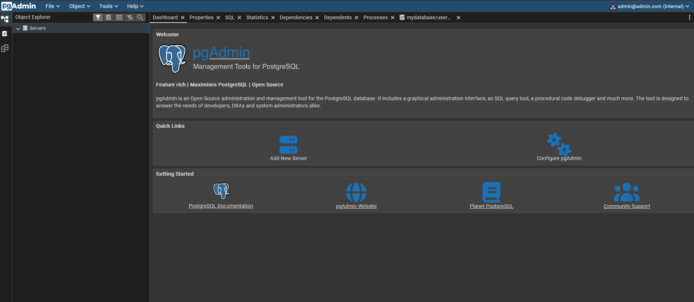
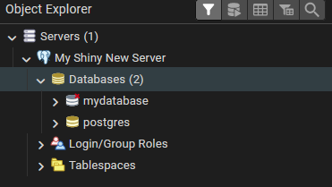

# {{ title }}
{{ description }}

<!-- more -->

Docker Compose is a tool that allows us to define and run multi-container Docker applications. It uses a YAML file to configure our application's services, networks, and volumes. Running long docker run commands manually is risky and hard to reproduce. Docker Compose fixes this by letting us define our entire architecture in a single configuration file (`docker-compose.yml`).

For this project, we will define two distinct services in our configuration file:

 - db: The PostgreSQL database.
 - pgAdmin: The web interface to manage that database.

## The Orchestrator
Let's create a new directory on our computer and an empty file inside it named `docker-compose.yml`. This file defines each application we want docker to run as services like this:
```yaml
services:
    service_name_1:
    ...
    service_name_2:
    ...
```
with `service_name`s being the custom name we will give to our app.

### The Database

Our first step will be to define the database service. Let's give it the service name `db` and have it use the official `postgres:16` image. All we have to do is write:
```yaml
services:
  db:
    image: postgres:16
```

As we can see inside the `db` service block we used `image` to set the image of our database service.

Now, for a database to function securely and effectively, it needs a bit of configuration—specifically, a username, password and database name. In Docker, we pass these configurations using environment variables.

Inside the `db` service block (at the same indentation level as `image`), we need to add an `environment` section:
```yaml
services:
  db:
    image: postgres:16
    environment:
      POSTGRES_USER: "user"
      POSTGRES_PASSWORD: "password"
      POSTGRES_DB: "mydatabase"
```
As their name suggests:

- `POSTGRES_USER`: defines the username of the database
- `POSTGRES_PASSWORD`: defines the password of the database
- `POSTGRES_DB`: defines the name of the database

!!! note

    By default, the image creates a database with the same name as the user. However, being explicit is safer. If we hadn't used `POSTGRES_DB: "mydatabase"`, the name of the created database would be `user`.

Now, we have a database service defined, but currently, it's locked inside the container. To verify it works or access it from our local computer, we usually need to "open a door" by mapping a port.

Inside the `db` block (at the same level as `image` and `environment`), we add a `ports` section to map port 5433 on our computer to port 5432 inside the container:

```yaml
services:
  db:
    image: postgres:16
    environment:
      POSTGRES_USER: "user"
      POSTGRES_PASSWORD: "password"
      POSTGRES_DB: "mydatabase"
    ports:
      - "5433:5432" 
```

Now it's time to add volumes. If we don't, any data we save into the database will vanish the moment the container is removed. Let's create a named volume by adding a `volumes` section inside the `db` block:
```yaml
services:
  db:
    image: postgres:16
    environment:
      POSTGRES_USER: "user"
      POSTGRES_PASSWORD: "password"
      POSTGRES_DB: "mydatabase"
    ports:
      - "5433:5432"
    volumes:
      - "pgdata:/var/lib/postgresql/data"

volumes:
  pgdata:
```

What's that new `volumes` section on the outside of the `services` block though? One "gotcha" with named volumes is that we must declare them at the very bottom of our `docker-compose.yml file` so Docker knows they exist.

### The Interface
Let's add pgAdmin to the mix. PgAdmin is a graphical user interface (GUI) tool for managing PostgreSQL databases, making it easier to create, maintain, and administer database objects.

All we have to do is to create another service inside the `services` block. Let's give it the service name `pgadmin`. Just like with the `db` block we will need four blocks:

- `image`: The official docker image for pgAdmin 4 is `dgage/pgadmin4`.
- `environment`: `PGADMIN_DEFAULT_EMAIL` and `PGADMIN_DEFAULT_PASSWORD` which will be the login credentials we will use on the login screen of pgAdmin.
- `ports`: We will map port `8085` on our computer to port `80` inside the container.
- `volumes`: We will map the named volume `pgadmin-data` to `/var/lib/pgadmin` inside the container.

Hence, we have that the final version of our `docker-compose.yml` is:
```yaml
services:
  db:
    image: postgres:16
    environment:
      POSTGRES_USER: "user"
      POSTGRES_PASSWORD: "password"
      POSTGRES_DB: "mydatabase"
    volumes:
      - "pgdata:/var/lib/postgresql/data"
    ports:
      - "5433:5432" 

  pgadmin:
    image: dpage/pgadmin4
    environment:
      PGADMIN_DEFAULT_EMAIL: "admin@admin.com"
      PGADMIN_DEFAULT_PASSWORD: "root"
    volumes:
      - "pgadmin-data:/var/lib/pgadmin"
    ports:
      - "8085:80"

volumes:
  pgdata:
  pgadmin-data:
```

Just like we did with `db`, we added the `pgadmin-data` volume on the `volumes` section which sits on the same level as the `services` section.


!!! note

    Technically, the pgAdmin container will start and run perfectly fine without any volumes. However, if you don't assign a volume, pgAdmin will have "amnesia." Every time we stop and restart the container, it will forget any server connections or preferences we set up in the web interface. We would have to re-enter the database credentials every single time. Nevertheless, no data would be lost, since the actual data live in the `db` service. The `pgadmin` service is just a window into the database.


## Startup Order

There is one small flaw in our current plan. By default, Docker starts all services in parallel to be as fast as possible. This creates a "race condition": `pgadmin` might start up and try to connect to the database before the `db` container has even finished waking up.

To fix this, we can tell Docker that `pgadmin` **depends on** the database. We do this by adding a `depends_on` block inside the `pgadmin` service:

```yaml
  pgadmin:
    image: dpage/pgadmin4
    environment:
      PGADMIN_DEFAULT_EMAIL: "admin@admin.com"
      PGADMIN_DEFAULT_PASSWORD: "root"
    volumes:
      - "pgadmin-data:/var/lib/pgadmin"
    ports:
      - "8085:80"
    depends_on:
      - db

```

This simple instruction tells Docker: "Do not start `pgadmin` until the `db` container is running."

!!! note


  It is important to know that `depends_on` only waits for the database **container** to start, not for the actual database **software** (PostgreSQL) inside it to be ready to accept connections. However, for most simple projects, this is enough to prevent errors, as pgAdmin is smart enough to retry the connection a few times if it fails initially.


## `docker compose up`
We now have both services in the same file, which means Docker automatically places them on the same network. This allows `pgadmin` to "see" the `db` service.

To get everything running, we need to use the terminal. Let's open a terminal in the folder where we have our file. All we have to do is run:
```bash
docker compose up
```

!!! note

    We can add the `-d` flag to that command (`docker compose up -d`) to run the containers in the "background" (detached mode) so they keep running even if we close the terminal. 

Once the command finishes, we should be able to open our browser and go to [http://localhost:8085](http://localhost:8085) to see the pgAdmin login screen.



After we log in with our email (`admin@admin.com`) and password (`root`), we will need to "Register" (add) a new server to connect to your PostgreSQL database. To do that, we click on "Add New Server".

In the General tab, we give a name to our server, for example `My Shiny New Server`.

### Host name/address

Next, we move on to the Connection tab. Here, pgAdmin asks for the **Host name/address**. One could think that we should put `localhost`. However, inside the pgAdmin container, `localhost` refers to the pgAdmin container itself, not our computer or the database!

Instead, we will use Docker's **Service Discovery**. When services are on the same Docker network, they identify each other by their service name, not the network name or localhost. Hence, we have to use the service name we gave to the database in our `docker-compose.yml` file, that is `db`.

### Port

Next, we need to specify a **Port**. In the `docker-compose.yml` file we mapped the port to `5433:5432` (Host Port : Container Port). Since pgAdmin is connecting from inside the Docker network we will use `5432`.

!!! note

    Internal container traffic (pgAdmin ↔ database) uses `db` and port `5432`. External traffic (Your Computer ↔ database) uses `localhost` and port `5433` (if we were to use a tool installed directly on our computer, like DBeaver or a local script).

### Maintenance Database
When pgAdmin first connects to a server, it needs to shake hands with some database immediately to read the system catalogs (the lists of other databases, users, etc.). This is what it calls the "Maintenance database".

The `postgres` image always includes a default database named `postgres` specifically for this administrative purpose. It is like the "lobby" of the building. `mydatabase`, the name we gave to our database through `POSTGRES_DB` is the specific room we built.

Hence, we put `postgres` in the Maintenance database

!!! note

    If we set the maintenance database to `mydatabase`, we are connected inside that specific database. This can cause "locking" issues later. For example, if we ever wanted to delete or rename `mydatabase` using pgAdmin, the system would block us and say, "I can't delete this database because you are currently standing inside it!"

### Username and Password
We set `user` for the `Username`, and `password` for the `Password` just like set them in `docker-compose.yml`.

### Final `docker-compose.yml` File
Here is our complete, final version of the `docker-compose.yml` file:

```yaml
services:
  db:
    image: postgres:16
    environment:
      POSTGRES_USER: "user"
      POSTGRES_PASSWORD: "password"
      POSTGRES_DB: "mydatabase"
    volumes:
      - "pgdata:/var/lib/postgresql/data"
    ports:
      - "5433:5432" 

  pgadmin:
    image: dpage/pgadmin4
    environment:
      PGADMIN_DEFAULT_EMAIL: "admin@admin.com"
      PGADMIN_DEFAULT_PASSWORD: "root"
    volumes:
      - "pgadmin-data:/var/lib/pgadmin"
    ports:
      - "8085:80"
    depends_on:
      - db

volumes:
  pgdata:
  pgadmin-data:
```

## Conclusion
We successfully managed to connect to the database.



Just to check that everything is working, let's right click on mydatabase and select Query Tool. In the panel that opens, let's type this command to simply check the database version:
```SQL
SELECT version();
```
By hitting the play button we see
```
PostgreSQL 16.11 (Debian 16.11-1.pgdg13+1) on x86_64-pc-linux-gnu, compiled by gcc (Debian 14.2.0-19) 14.2.0, 64-bit
```

Finally, if we want to stop the docker containers and remove the networks (but keep our data safe in the volumes), we'll go back to the terminal and type
```bash
docker compose down 
```