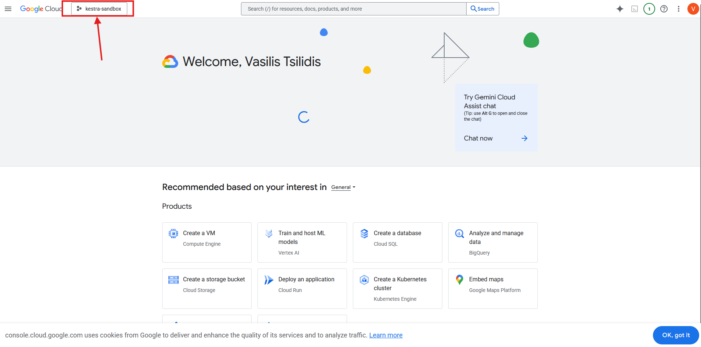
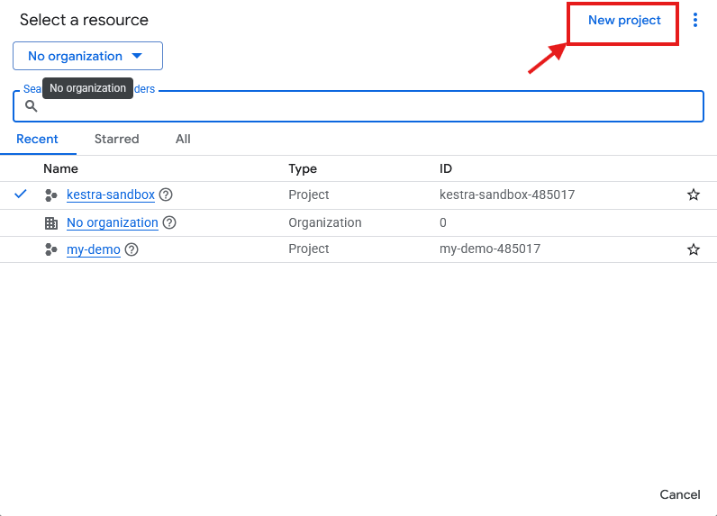
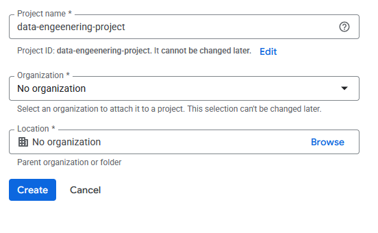
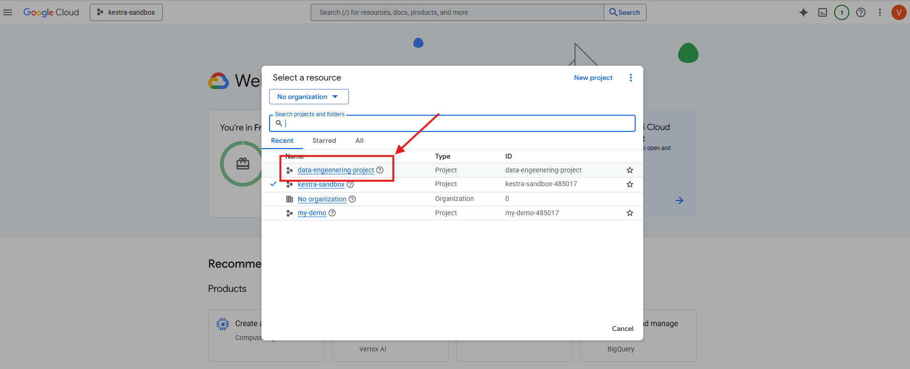
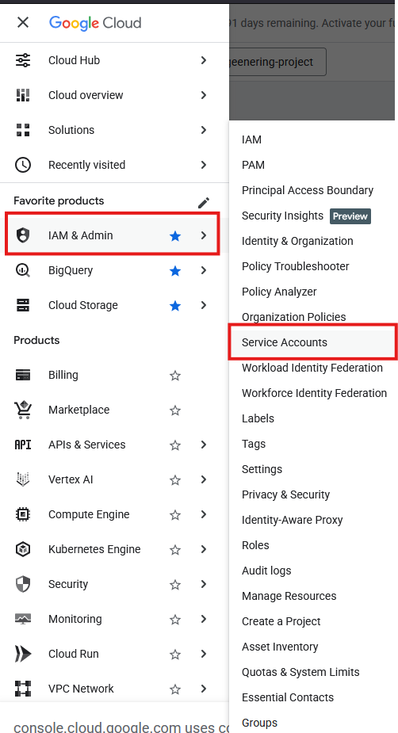
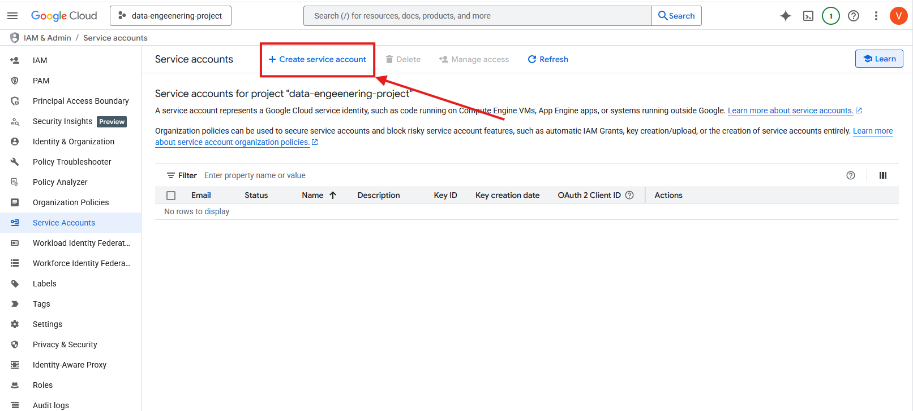

# {{ title }}
{{ description }}


<!-- more -->


Let's begin by creating a project in GCP.

## Creating a Project and Downloading its Keys in GCP
Let's go to Google Cloud and create a new project. To do that:

1. Log in to https://console.cloud.google.com/
2. Click on the drop down menu at the top

3. Click on new project

4. Name the project and click "Create"

5. Select the new project by first clicking on the drop down menu at the top

6. Go to IAM & Admin > Service Accounts

7. Click on Create service account

8. Name the service account under step 1, and give it the Owner role under step 2. Then, click Done.
9. Select the service account we created and click on the "Keys" tab.
10. Click Add key > Create new key. Then, pick the JSON key type and click on Create.
11. Download the file. 

!!! note

    It's imperative to never show this file to anyone!

Perfect, now we have created a project, and have access to its keys. Before we move on, let's rename the JSON file to `service-account.json`.

## Using Terraform

Let's create a folder for our project. Then, let's create another folder inside of it, called `keys` where we'll place our `service-account.json`. 

Now, let's create our `main.tf` file, our main terraform file. Searching Terraform's [documentation for GCP](https://registry.terraform.io/providers/hashicorp/google/latest/docs/guides/provider_reference), we see that in order to use GCP, we have to include the following in our `main.tf`:

```terraform
terraform {
  required_providers {
    google = {
      source = "hashicorp/google"
      version = "7.16.0"
    }
  }
}

provider "google" {
  # Configuration options
}
```

In the `provider` block we can configure our credentials, along with the location for our resources. Before we do that, and to avoid hardcoding stuff into our `main.tf`, let's create another file called `variables.tf` which will look like this:

```terraform
variable "credentials" {
  description = "My Credentials"
  # Point to the location of service-account.json file
  default     = "./keys/service-account.json"
}

variable "project" {
  description = "Project"
  # Name of the Project ID whithin which the bucket will be created 
  default     = "data-engeenering-project" 
}

variable "region" {
  description = "Region"
  # Desired region
  default = "europe-north1"
}
``` 

Let's reference those back to our `main.tf`:

```terraform
terraform {
  required_providers {
    google = {
      source = "hashicorp/google"
      version = "7.16.0"
    }
  }
}

provider "google" {
  credentials = file(var.credentials)
  project     = var.project
  region      = var.region
}
```

Now, let's initilize our project by running `terraform init` in the terminal. The `terraform init` command initializes our working directory for Terraform by setting up necessary files, downloading provider plugins. It also prepares our environment for further commands like `terraform plan` and `terraform apply`, which we will see shortly.

### Creating a Bucket
Let's search terraform's documentation for creating a bucket. We can find some useful templates there, like this one:

```terraform
resource "google_storage_bucket" "auto-expire" {
  name          = "auto-expiring-bucket"
  location      = "US"
  force_destroy = true

  lifecycle_rule {
    condition {
      age = 3
    }
    action {
      type = "Delete"
    }
  }

  lifecycle_rule {
    condition {
      age = 1
    }
    action {
      type = "AbortIncompleteMultipartUpload"
    }
  }
}
```

In the first line of the block, we have that `google_storage_bucket` defines the name of the global name of the block which defines its use. The second name, `auto-expire`, is the local variable name and we can set it to whatever we want. We can use this name to reffer to this bucket in subsequent blocks.

Inside the block, we have the required field of `name`, which specifies the name of our bucket, and location, which is the [GCS location](https://cloud.google.com/storage/docs/bucket-locations).

The rest of the fields are optional. When `force_destroy` is set to `true`, it will delete all objects within the bucket, before deleting the bucket itself. If set to `false`, buckets with objects will fail.

A `lifecycle_rule` performs an action when a time-related condition is met. For example, the first `lifecycle_rule` permanently deletes any file (object) in this bucket three day after it is created. The second `lifecycle_rule` aborts an incomplete multipart upload and deletes the associated parts after one day of the initialization of the upload.

Let's add this template to our `main.tf` and at the same time update our `variables.tf`:

`main.tf`:
```terraform
resource "google_storage_bucket" "local_variable_name_for_bucket" {
  name          = var.gcs_bucket_name
  location      = var.location
  force_destroy = true

  lifecycle_rule {
    condition {
      age = 3
    }
    action {
      type = "Delete"
    }
  }

  lifecycle_rule {
    condition {
      age = 1
    }
    action {
      type = "AbortIncompleteMultipartUpload"
    }
  }
}
```

`variables.tf`:
```terraform
variable "credentials" {
  description = "My Credentials"
  # Point to the location of service-account.json file
  default     = "./keys/service-account.json"
}

variable "project" {
  description = "Project"
  # Name of the Project ID whithin which the bucket will be created 
  default     = "data-engineering-project" 
}

variable "region" {
  description = "Region"
  # Desired region
  default = "europe-north1"
}

variable "location" {
  description = "Project Location"
  # Desired location
  default = "EU"
}

variable "gcs_bucket_name" {
  description = "My Storage Bucket Name"
  # Update to a unique bucket name
  default = "my-first-gcp-bucket-wow"
}
```

We're now ready to run our second command, which is `terraform plan`. The `terraform plan` command is used to create an execution plan that previews the changes Terraform will make to our infrastructure based on our current configuration. It helps you review and validate the proposed changes before applying them, ensuring that they align with our intentions.

After carefully reviewing the output in the terminal, let's run `terraform apply`. The terraform apply command is used to execute the changes defined in a Terraform plan, creating, updating, or destroying infrastructure resources as specified in our configuration files. We need to type "yes" in the terminal to confirm the changes.

We should now be able to see our newly created bucket in our GCS! 

Finally, if we ever want to remove the bucket we created, we can run `terraform destroy`. The `terraform destroy` command is used to remove all resources managed by a Terraform configuration. It deprovisions the infrastructure, allowing us to clean up resources that are no longer needed.

!!! note

    When choosing a name for your `google_storage_bucket` resource, remember that while the **local name** (e.g., `local_variable_name_for_bucket`) only needs to be unique within your Terraform script, the **bucket name** (`name = var.gcs_bucket_name`) must be **globally unique** across the entire Google Cloud ecosystem. This means if another user in another organization has already claimed a name, your `terraform apply` will fail. Additionally, it is best practice to use underscores for Terraform resource names and hyphens for the actual GCS bucket names to follow standard naming conventions.

## The Terraform Security Checklist

* **Implement a `.gitignore`:** Before your first `git commit`, ensure you have a `.gitignore` file that explicitly excludes `*.json` and the `.terraform/` directory. It's imperative to **NEVER** share your secrets with anyone.
* **The Principle of Least Privilege:** Instead of the **Owner** role, assign the most restrictive role possible (e.g., `roles/storage.admin` or `roles/editor`) to your service account to limit potential damage from a leaked key.
* **Keep State Files Local or Encrypted:** The `terraform.tfstate` file can contain sensitive data in plain text. Never upload it to a public repository; instead, use a remote backend like a GCS bucket with encryption.
* **Avoid Hardcoding:** Never type your Project ID or file paths directly into `main.tf`. Always use `variables.tf` or environment variables to keep your main logic clean and portable.

Here's an example .gitignore file:
```text
# Local provider directory
.terraform/

# Sensitive credential files
keys/
*.json

# Terraform state files
*.tfstate
*.tfstate.backup
```